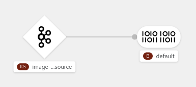
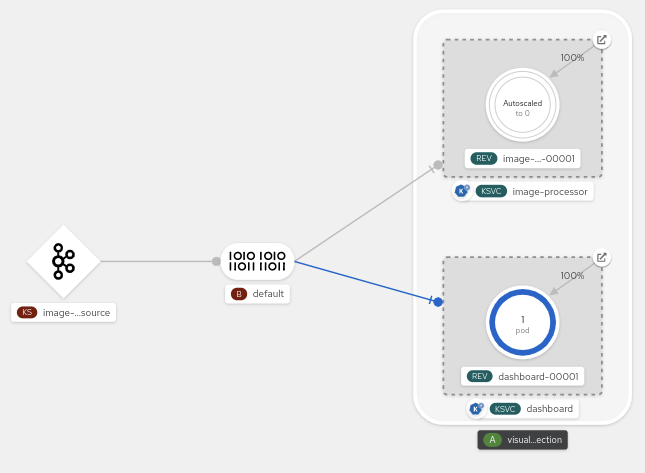
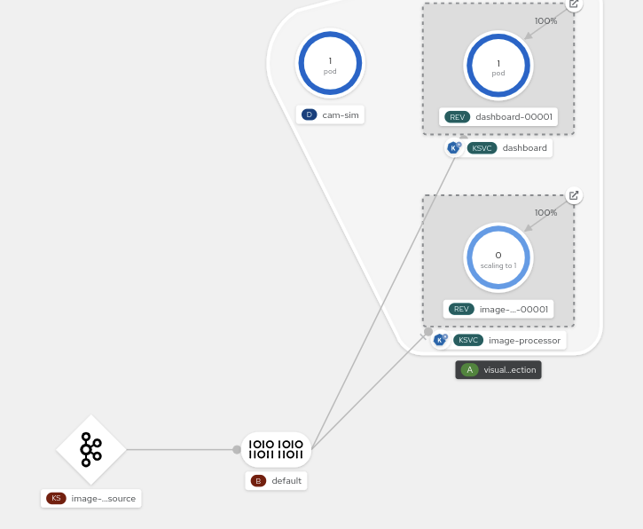

# Visual Inspection Runtime <!-- omit in toc -->
This section describes the installation of the runtime on OpenShift. The model training is described in [ml/README.md](../ml/README.md). And the image annotation is explained in [here](cvat-cnv.md).


- [Prerequisites](#prerequisites)
- [Installation](#installation)
  - [Create namespaces](#create-namespaces)
  - [Create a kafka cluster and topic](#create-a-kafka-cluster-and-topic)
  - [Build the Camera simulator](#build-the-camera-simulator)
  - [Build the images-processor](#build-the-images-processor)
  - [Build the dashboard](#build-the-dashboard)
- [Demo Execution](#demo-execution)
  - [Deploy the images-processor](#deploy-the-images-processor)
  - [Connect to kafka](#connect-to-kafka)
  - [Deploy the dashboard](#deploy-the-dashboard)
  - [Deploy the Camera simulator](#deploy-the-camera-simulator)
- [Visual Inspection ML inferencing demo](#visual-inspection-ml-inferencing-demo)
- [Demo Clean-up](#demo-clean-up)


## Prerequisites
- Red Hat OpenShift Serverless Operator is installed (knative)
- Red Hat Integration - AMQ Streams Operator is installed (kafka)
- This repo is cloned into your home directory

## Installation
This installation section describes only the configuration of kafka and building the container images. The installation is finalized as part of the demo in the following section.


### Create namespaces

Create the namespace/project via the OpenShift UI or CLI.

```
oc new-project manuela-visual-inspection
```

### Create a kafka cluster and topic

Deploy the Red Hat Integration AMQ Streams operator first via the OpertorHub.

Then create a kafka cluster and topic:

```
oc apply -f manifests/kafka-cluster.yaml
```
Wait until the cluster is up and running. E.g.:
```
oc get pods
NAME                                                   READY   STATUS    RESTARTS   AGE
amq-streams-cluster-operator-v1.7.0-67b4df466f-skc8r   1/1     Running   0          17m
manu-vi-entity-operator-84fbfbcc84-x5dnt               2/3     Running   0          97s
manu-vi-kafka-0                                        1/1     Running   0          2m12s
manu-vi-kafka-1                                        1/1     Running   0          2m12s
manu-vi-kafka-2                                        1/1     Running   0          2m12s
manu-vi-zookeeper-0                                    1/1     Running   0          3m14s
manu-vi-zookeeper-1                                    1/1     Running   0          3m14s
manu-vi-zookeeper-2                                    1/1     Running   0          3m14s

```

Create a topic for the images:

```
oc apply -f manifests/kafka-topic-vs.yaml 
```

### Build the Camera simulator

The camera simulator (cam-sim) sends images into the image processor backend via a kafka topic.

Start the build:

```
oc apply -f cam/manifests/cam-sim-bc.yaml
```

Watch the build ...

```
oc logs -f bc/cam-sim 
..,
Successfully pushed image-registry.openshift-image-registry.svc:5000/manuela-visual-inspection/cam-sim@sha256:389766a7787cce83b0178eb537a9e16659cac5626da31485508d22cba083ca0a
Push successful
...
```

### Build the images-processor

The images-processor is implemented as knative service. It processes the submitted images and detects anomalies.


Start the build:

```
oc apply -f image-processor/manifests/image-processor-bc.yaml
```

Follow the build logs ..
```
oc logs bc/image-processor -f
...
Storing signatures
Successfully pushed image-registry.openshift-image-registry.svc:5000/manuela-visual-inspection/image-processor@sha256:1bf0c36cc522aa8f5ff1f7780d0b89adb8054b88a0cf6b0d8e10de41d8208321

```

### Build the dashboard

The dashboard shows the incoming images and highlights the anomalies with colored bounding boxes.
The dashboard is implemented as knative service.


Start the build:

```
oc apply -f dashboard/manifests/dashboard-bc.yaml
```

Follow the build logs:
```
oc logs bc/dashboard -f
...
Storing signatures
Successfully pushed image-registry.openshift-image-registry.svc:5000/...
Push successful
```

## Demo Execution

During the demo we are going to finalize the installation and explain each component of the serverless architecture. 


### Deploy the images-processor

The images-processor is implemented as knative service. It processes the submitted images and detects anomalies.


Deploy the knative service:

```
oc apply -f image-processor/manifests/image-processor-kn-svc.yaml
```

If applicable, explain the [image-processor-kn-svc.yaml](../image-processor/manifests/image-processor-kn-svc.yaml)

Show and explain the Serverless Services and Revisions in the OpenShift Admin Console:


After the initial startup, the service is scaled back to zero because the service does not receive any images yet. See the Developer Console:


### Connect to kafka

The images-processor does not need to deal with any kafka details. It just receives [Cloud-Events](https://cloudevents.io/) via a [broker and trigger](https://knative.dev/docs/eventing/#event-brokers-and-triggers).


The images-processor python snippet shows that it is agnostic to Kafka or any other event source:

```python
@app.route('/', methods=['POST'])
def process_image():
    # app.logger.debug(request.headers)

    # create a CloudEvent
    event = from_http(request.headers, request.get_data())

    # you can access cloudevent fields as seen below
    app.logger.info(
        f"Found {event['dashboardid']} from {event['source']} with type "
        f"{event['type']} and specversion {event['specversion']}"
    )
...
```

The Knative Service has been already created with the previous step

```
oc get ksvc image-processor

NAME              URL                                                                                        LATESTCREATED           LATESTREADY             READY   REASON
image-processor   http://image-processor-manuela-visual-inspection.apps.ocp5.stormshift.coe.muc.redhat.com   image-processor-00001   image-processor-00001   True    
```


Let's define a default broker and a [Kafka-Source](../image-processor/manifests/image-processor-kafkasource.yaml) and set the sink to the default broker:
```
oc apply -f image-processor/manifests/image-processor-kafkasource.yaml
```

Check the topology in the Developer Console:



Now we just need to set the [trigger](../image-processor/manifests/image-processor-trigger.yaml) so that the service receives images as cloud events:

```
oc apply -f image-processor/manifests/image-processor-trigger.yaml
```

The broker is now connected to the image-processor knative service:


The Service is stilled scaled to zero.


### Deploy the dashboard

The dashboard shows the incoming images and highlights the anomalies with colored bounding boxes.
The dashboard is implemented as knative service and receives cloud events, which are emitted by the image processor.  

Deploy the dashboard [knative service](../dashboard/manifests/dashboard-kn-svc.yaml) and [trigger](../dashboard/manifests/dashboard-trigger.yaml):

```
oc apply -k dashboard/manifests
```

Show the developer console:



Open the Dashboard user via OpenShift Admin Console -> Serverless -> Routes:


Or get the URL of the dashboard via cli:
```
oc get routes.serving.knative.dev dashboard

NAME        URL                                                                                  READY   REASON
dashboard   http://dashboard-manuela-visual-inspection.apps.ocp5.stormshift.coe.muc.redhat.com   True    
```


Click on the Dashboard URL and navigate to `Automated Visual Inspection`:

No images are displayed yet, because the camera simulator (cam-sim) is not running.


###  Deploy the Camera simulator

The camera simulator (cam-sim) sends images into the backend via a kafka topic.

Deploy the simulator:

```
oc apply -f cam/manifests/cam-sim-depl.yaml 
```

Check and show that pod is running and submitting images:

```
oc logs -l app=cam-sim
...
client.py (INFO): Imagae 36: {'label': 'good', 'path': 'data/metal_nut/good/178.png'}
client.py (INFO): Message sent: visual-inspection-images - 2021-01-24 18:48:45.479030 - (350, 350, 3)
client.py (INFO): Imagae 37: {'label': 'scratch', 'path': 'data/metal_nut/scratch/020.png'}
...
```

**image-processor is scaling**

The image-processor is receiving cloud events and i is starting.
Note, be patient. It takes some time to start the image-processor pod because it needs to initialize TensorFlow and load the model.




Once it is started you can see  the log of the dashboard knative service

```
oc logs -l serving.knative.dev/service=dashboard -c dashboard -f
...
emitting event "server2ui2" to all [/ui2]
emitting event "server2ui2" to all [/ui2]
...

```

... or view the dashboard.


**View the dashboard:**


*ATTRIBUTION: Paul Bergmann, Michael Fauser, David Sattlegger, Carsten Steger. [MVTec AD](https://www.mvtec.com/company/research/datasets/mvtec-ad) - A Comprehensive Real-World Dataset for Unsupervised Anomaly Detection; in: IEEE Conference on Computer Vision and Pattern Recognition (CVPR), June 2019*


## Visual Inspection ML inferencing demo 

It is not a lot to demo for the ML inferencing beside showing the dashboard and the logs. The image-processor knative service receives images from kafka, does the tensorflow based inferencing and emits a cloud event for the dashboard and action processor.

Beside viewing the dashboard with the bounding boxes for the anomalies, you can view the log of the images-processor:

```
oc logs -l serving.knative.dev/service=image-processor -c image-processor -f
...
[2021-03-06 20:08:55,959] INFO in image-processor: 2021-03-06 20:08:55.877409 (350, 350, 3)
[2021-03-06 20:08:56,298] INFO in image-processor: Predict: Total object detection took 0.33952 seconds
[2021-03-06 20:08:56,298] INFO in image-processor: ['scratch']
...
```

The `image-processor` receives cloud event that includes a images, calls the TensorFlow ML model, and predicts an anomaly (scratch or bent).


## Demo Clean-up

```
oc delete -f cam/manifests/cam-sim-depl.yaml
oc delete -k dashboard/manifests/
oc delete -k image-processor/manifests/
```
